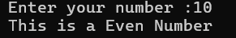

# Odd or Even Number Checker (Java)

This is a simple Java console application that checks whether a number entered by the user is odd or even.

## 🔧 Requirements
- Java JDK (version 8 or higher)

## 🧪 How to Run

1. Clone or download this repository.
2. Open the terminal and navigate to the project directory.
3. Compile the Java file:
4. Run the program:

## 👨‍💻 Example Output

## 🧠 Concepts Used
- Java `Scanner` class
- If-Else statements
- Modulus operator (`%`)
